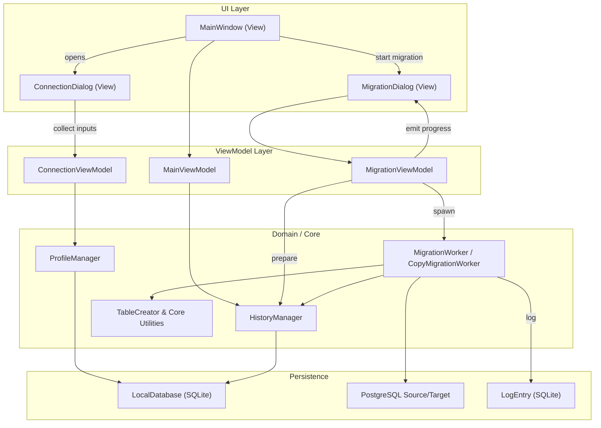
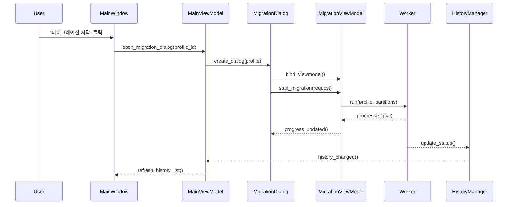

# UI 아키텍처 개요

이 문서는 최근 리팩토링 이후 프로젝트 구조와 UI에서 핵심 기능으로 이어지는 흐름을 빠르게 파악할 수 있도록 정리한 자료입니다.

---

## 1. 프로젝트 구조 스냅샷

```text
db_migration_tool/
├── src/
│   ├── core/                  # 마이그레이션 워커, 파티션 탐색 등 핵심 로직
│   ├── database/              # 로컬 SQLite 및 PostgreSQL 유틸리티
│   ├── models/                # DTO 및 관리자 (History, Profile 등)
│   ├── ui/
│   │   ├── dialogs/           # 개별 UI 다이얼로그 (Connection, Migration 등)
│   │   ├── viewmodels/        # UI 상태/액션을 담당하는 ViewModel 계층
│   │   ├── widgets/           # 재사용 가능한 위젯 컴포넌트
│   │   └── main_window.py     # 메인 윈도우 (ViewModel 주입)
│   └── utils/                 # 로거, 경로 헬퍼 등 공용 유틸
└── docs/                      # 문서 (refac, analyze 등)
```

핵심 변화:
- UI 로직은 `viewmodels/` 계층으로 이동하여 Qt 위젯과 도메인 로직이 분리되었습니다.
- `core/`와 `models/` 폴더는 기존과 동일하게 비즈니스 로직과 데이터 접근을 담당합니다.

---

## 2. UI → 핵심 기능 흐름

아래 Mermaid 다이어그램은 사용자가 메인 화면에서 마이그레이션을 실행할 때 거치는 주요 경로를 나타냅니다.



**Flow 설명**
1. 메인 윈도우(`MainWindow`)는 `MainViewModel`과 연결되어 초기 프로필/이력 데이터를 로드합니다.
2. 사용자 요청에 따라 `ConnectionDialog`가 열리면 `ConnectionViewModel`이 입력값 검증과 프로필 저장/수정을 담당하고, `ProfileManager`를 통해 로컬 DB에 반영합니다.
3. 마이그레이션을 시작하면 `MigrationDialog`가 `MigrationViewModel`을 통해 워커(`MigrationWorker`, `CopyMigrationWorker`)를 구동합니다. 워커는 PostgreSQL에 연결해 데이터를 복사하고, 진행 상황과 로그를 ViewModel로 전송합니다.
4. ViewModel은 진행률·연결 상태·히스토리 업데이트를 UI와 로컬 DB에 동기화합니다.

---

## 3. 핵심 시그널/데이터 흐름



주요 체크포인트:
- View는 ViewModel을 통해서만 상태를 변경하며, 워커 시그널은 ViewModel이 받아 UI에 전달합니다.
- `HistoryManager`와 `ProfileManager`는 ViewModel이 호출하고, 결과는 UI로 반영됩니다.

---

## 4. 참고 문서
- `docs/refac/05_ui_architecture_refactoring.md`: UI 리팩토링 단계별 목표 및 테스트 전략
- `docs/refac/README.md`: 전체 리팩토링 로드맵 및 상태
- `src/ui/viewmodels/`: 실제 ViewModel 구현 코드

이 문서를 최신 상태로 유지하려면 주요 구조 변경 후 Mermaid 그래프와 시퀀스 다이어그램을 갱신해 주세요.
