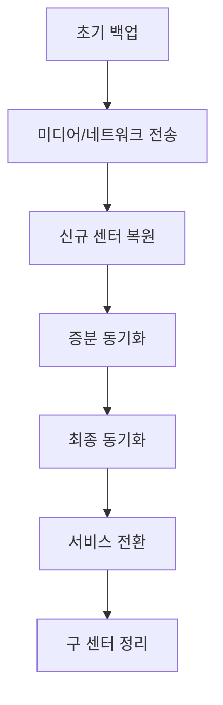

# DB Migration Tool - 데이터베이스 마이그레이션 시나리오

## 하드웨어 교체 시 데이터 이관 시나리오

### 시나리오 1: 동일 버전 PostgreSQL 9.3 서버 간 데이터 이관

#### 배경
- 노후 하드웨어 교체로 인한 새 서버로의 데이터 이관
- PostgreSQL 9.3 버전 유지 (애플리케이션 호환성)
- 전체 데이터 이력 및 설정 완벽 이관
- 최소 다운타임으로 서비스 연속성 보장

#### 주요 고려사항

1. **데이터 무결성**
   - 모든 테이블 데이터 완전 이관
   - 시퀀스 값 보존
   - 인덱스 및 제약조건 유지
   - 사용자 권한 및 롤 이관

2. **설정 이관**
   - postgresql.conf 설정 이관
   - pg_hba.conf 인증 설정
   - 확장 모듈 및 함수
   - 트리거 및 프로시저

3. **다운타임 최소화**
   - 증분 백업 활용
   - 빠른 전환 계획
   - 롤백 시나리오 준비

#### 마이그레이션 단계


1. **사전준비 단계**
   - 현재 데이터베이스 크기 확인
   - 디스크 공간 계산
   - 네트워크 대역폭 확인
   - 이관 일정 수립

2. **초기백업 단계**
   - pg_dumpall을 이용한 전체 백업
   - 파일 시스템 레벨 백업 (옵션)
   - 백업 검증

3. **신규서버구성**
   - PostgreSQL 9.3 설치
   - 동일한 OS 설정
   - 필요한 라이브러리 설치
   - 디렉토리 구조 생성

4. **데이터동기화**
   - 초기 데이터 복원
   - WAL 아카이브 설정
   - 지속적 동기화 시작

5. **최종동기화**
   - 서비스 중단
   - 마지막 변경사항 동기화
   - 데이터 일관성 확인

6. **서비스전환**
   - IP 주소 전환 또는 DNS 변경
   - 애플리케이션 연결 테스트
   - 서비스 정상 작동 확인

7. **검증**
   - 데이터 수 비교
   - 주요 기능 테스트
   - 성능 모니터링

### 시나리오 2: 물리적 복제를 통한 무중단 이관

#### 배경
- 24/7 운영 중인 시스템의 하드웨어 교체
- 서비스 중단 없이 데이터 이관 필요
- PostgreSQL 9.3 스트리밍 복제 활용

#### 실행 전략

1. **스트리밍 복제 설정**
   ```
   기존서버(Master) → 신규서버(Standby)
   실시간 데이터 동기화
   ```

2. **복제 구성 단계**
   - postgresql.conf 설정
     - wal_level = hot_standby
     - max_wal_senders = 3
     - wal_keep_segments = 64
   - pg_hba.conf 복제 권한 설정
   - 베이스 백업 수행

3. **모니터링 및 검증**
   - 복제 지연(lag) 모니터링
   - 데이터 일관성 검증
   - 애플리케이션 읽기 테스트

#### 전환 프로세스

**Phase 1: 복제 환경 구축**
- 신규 서버에 PostgreSQL 9.3 설치
- 네트워크 연결 확인
- 스트리밍 복제 시작

**Phase 2: 동기화 확인**
- 복제 상태 모니터링
- 데이터 정합성 검증
- 부하 테스트 수행

**Phase 3: 역할 전환**
- 애플리케이션 연결 차단 (수초)
- 기존 서버를 읽기 전용으로 전환
- 신규 서버를 마스터로 승격
- 애플리케이션 연결 전환

### 시나리오 3: 대용량 데이터베이스의 안전한 이관

#### 배경
- 수 TB 규모의 PostgreSQL 9.3 데이터베이스
- 하드웨어 교체로 인한 전체 데이터 이관
- 데이터 손실 없는 완벽한 이관 필요

#### 이관 전략

1. **병렬 처리 방식**
   - 테이블별 독립적 이관
   - 파티션 단위 처리
   - 다중 연결을 통한 속도 향상

2. **데이터 검증 강화**
   - 테이블별 체크섬 비교
   - 행 수 및 크기 검증
   - 샘플 데이터 상세 비교

#### 실행 방법

```
Phase 1: 정적 데이터 이관 (1-3일)
  - 마스터 데이터
  - 코드 테이블
  - 이력 데이터

Phase 2: 동적 데이터 준비 (4-5일)
  - 트랜잭션 테이블 초기 복사
  - 증분 백업 설정
  - 동기화 테스트

Phase 3: 최종 이관 (6일차)
  - 서비스 정지 (2-4시간)
  - 최종 데이터 동기화
  - 전체 검증 수행
  - 서비스 재개
```

### 시나리오 4: 단계별 테이블 이관

#### 배경
- 업무 중요도에 따른 단계적 하드웨어 이관
- 리스크 분산을 위한 점진적 접근
- 각 단계별 검증을 통한 안정성 확보

#### 테이블 분류 및 우선순위

1. **1단계: 참조 데이터**
   - 마스터 테이블
   - 코드 테이블
   - 설정 테이블
   - 다운타임: 30분 이내

2. **2단계: 이력 데이터**
   - 로그 테이블
   - 감사 테이블
   - 백업 테이블
   - 다운타임: 1시간 이내

3. **3단계: 핵심 업무 데이터**
   - 트랜잭션 테이블
   - 사용자 테이블
   - 실시간 데이터
   - 다운타임: 2-3시간

#### 이관 프로세스

```
Week 1: 1단계 테이블 이관
  - 참조 데이터 백업 및 복원
  - 애플리케이션 연결 테스트
  - 1주일 병행 운영

Week 2: 2단계 테이블 이관
  - 이력 데이터 이관
  - 데이터 정합성 검증
  - 성능 모니터링

Week 3: 3단계 최종 이관
  - 핵심 데이터 동기화
  - 전체 시스템 전환
  - 구 시스템 백업 후 정지
```

### 시나리오 5: 데이터센터 간 이관

#### 배경
- 데이터센터 이전으로 인한 서버 재배치
- 원거리 네트워크를 통한 데이터 전송
- 네트워크 대역폭 제약 고려

#### 이관 전략

1. **네트워크 최적화**
   - 데이터 압축 전송 (gzip, lz4)
   - 병렬 전송 채널 활용
   - 대역폭 제한 설정으로 업무 영향 최소화

2. **데이터 전송 방식**
   - 물리적 미디어 활용 (대용량의 경우)
   - 증분 백업을 통한 단계적 전송
   - 체크포인트 기반 재개 기능

3. **보안 고려사항**
   - VPN 터널을 통한 암호화 전송
   - 데이터 무결성 검증
   - 접근 권한 관리

#### 이관 단계



## 이관 도구 기능 최적화

### 하드웨어 이관 특화 기능

1. **백업/복원 최적화**
   - pg_dump 병렬 옵션 활용 (-j 옵션)
   - 커스텀 형식으로 압축 백업
   - 테이블별 독립 백업 지원

2. **데이터 검증 기능**
   - MD5 체크섬 비교
   - 행 단위 데이터 샘플링
   - 스키마 구조 완전성 검사

3. **진행 상황 모니터링**
   - 실시간 전송 속도 표시
   - 예상 완료 시간 계산
   - 테이블별 진행률 추적

### 자동화 기능

1. **스크립트 생성**
   - 백업 스크립트 자동 생성
   - 복원 스크립트 생성
   - 검증 스크립트 제공

2. **설정 이관**
   - PostgreSQL 설정 파일 백업/복원
   - 사용자 및 권한 완벽 이관
   - 확장 모듈 목록 관리

## 문제 해결 가이드

### 하드웨어 이관 시 주요 체크포인트

1. **이관 전 확인사항**
   - 디스크 공간 (소스 DB 크기의 2배 이상)
   - PostgreSQL 버전 일치 (9.3.x)
   - OS 및 라이브러리 호환성
   - 문자셋 및 로케일 설정

2. **이관 중 모니터링**
   - 디스크 I/O 부하
   - 네트워크 대역폭 사용률
   - 메모리 사용량
   - 에러 로그 실시간 확인

3. **이관 후 검증**
   - 전체 테이블 행 수 비교
   - 시퀀스 현재값 확인
   - 인덱스 재구성 필요성 판단
   - 애플리케이션 연동 테스트

### 트러블슈팅

1. **백업/복원 실패**
   - 권한 문제: 파일 시스템 권한 확인
   - 공간 부족: 임시 디렉토리 용량 확인
   - 네트워크 단절: 재시도 로직 구현

2. **데이터 불일치**
   - 트랜잭션 중간 상태: 애플리케이션 정지 후 이관
   - 시퀀스 값 차이: 수동으로 시퀀스 조정
   - 타임스탬프 차이: 시간대 설정 확인

3. **성능 저하**
   - ANALYZE 미실행: 통계정보 갱신
   - 인덱스 파편화: REINDEX 수행
   - 잘못된 설정값: postgresql.conf 최적화